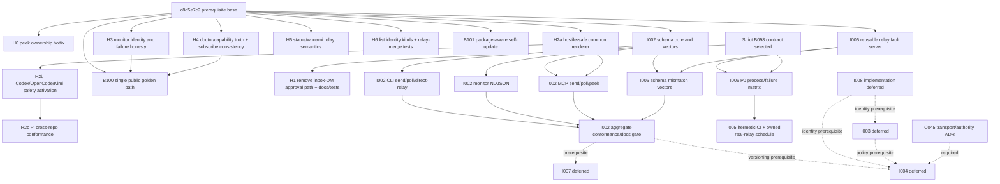

# Reconciliation plan for all 406 `friction-points-cn.md` inventory rows

Date: 2026-07-10
Implementation base: `c8d5e7c93070058907fa5f342c23c45f63772b2e` (contains local-only B087-B100 prerequisite work)

This artifact converts the complete T0 inventory plus reviewed T1-T3 gaps into
bounded slices or explicit authority dispositions. It does not change code,
backlog state, product decisions, or the relay. Stable `B###` references below
mean **inventory rows** unless prefixed `backlog B###`.

## Reconciled result

The report is not completely addressed. Two critical security findings and
several truthfulness gaps are immediately actionable. The coordinator resolved
the B098 conflict in favor of the strict source/backlog contract: no inbox or
relay message, including a configured-supervisor DM, may resolve an approval.
I002, I005, and backlog B101 remain actionable. Max's
I003/I004/I007/I008 implementation deferrals remain intact. Stale I006 is split
rather than implemented as written. Product/IA proposals are not silently
promoted into commitments.

Security classification in this plan is advisory evidence; the coordinator
owns final severity and sequencing.

## Mandatory authority reconciliations

### B089 versus I002

Backlog B089 is closed only for **unified relay-aware monitoring as a source**.
It does not provide the versioned send/monitor/poll/MCP contract. Preserve B089
source/dedup behavior while J1-J5 implement I002. The newly discovered wrong
connector-inbox default and silent `ok:false -> []` behavior are H3 correctness
bugs, not reasons to merge I002 into B089.

### B096 versus I004

Backlog B096's delivered subset is non-destructive peek. Its missing signed-owner
check is immediate H0 security work. Durable server cursors, independent consumer
progress, at-least-once delivery, delivery/consume acks, receipts, and
`send --wait` remain explicitly deferred under I004. Do not reopen or dispatch
that protocol program under the B096 label.

### B098: strict source contract versus current configured-supervisor RPC

Authoritative evidence conflicts:

- Backlog B098 requires local-operator-only approval, unreachable from **any**
  relay-delivered message, and says no message directly causes action.
- `c2c_approval_paths.ml` and `await_reply_cmd` deliberately accept token-bearing
  inbox DMs from locally configured supervisors and explicitly allow those
  supervisors to be remote peers.
- Both named “remote cannot reach” tests accept supervisor DMs and reject only
  non-supervisors. Relay delivery enters the same inbox and the message record
  has no transport provenance.
- AGENTS/CLAUDE/changelog prose contains both absolute wording and the carve-out.

The coordinator has selected option 1 below. Authority is the operator's direct
request to make `friction-points-cn.md` completely addressed, combined with the
explicit critical B098 backlog requirement. The current AGENTS/implementation
carve-out is therefore stale behavior/documentation to remove in H1, not an
authority to weaken B098.

1. **Recommended strict contract:** remove inbox-DM verdict resolution; only the
   host-local verdict file/CLI resolves approval; even configured-supervisor
   messages are inert data.
2. **Rejected weaker configured-supervisor contract:** preserve RPC-like DM approval, but
   explicitly revise B098, the test names, and every absolute bus-never-RPC /
   local-operator-only / unreachable-from-relay claim.

H1 is unblocked and must implement the strict contract. The shared safety and
peek-auth hotfixes remain independently parallelizable.

## Ordered dependency graph

## Ordered parallel start set

Start the first wave now, each in its own worktree: **H0, H1, H2a**. These are
the three unblocked security fixes and have exclusive production/test ownership.
After that review gate, start H3, H4, and F101. Serialize the shared
`ocaml/test/dune` lane as H4 -> J1 -> H5 -> H6 -> F5a unless a slice review
proves it uses no manifest edit. D1 can
draft editorial structure independently but takes final command/output updates
after H3/H4. Q1 and ADR0 are final-proof/decision-ledger gates described below.

## Bounded implementation slices

| Slice | Scope / owned files | Base / prerequisites | Tests, docs, and live proof | Inventory rows |
|---|---|---|---|---|
| H0 | Pass verified identity into peek and enforce inbox ownership. Own `ocaml/relay.ml` and existing `ocaml/test/test_relay_remote_broker.ml` only; no dune-manifest edit. | `c8d5e7c9`; independent | Signed victim/attacker, unsigned-policy, InMemory+SQLite; `just check`; security note if behavior changes. | A021/A035; B111; C019 constraint; T2 audit gap |
| H1 | Remove inbox-DM verdict resolution and implement the selected strict B098 contract. Own `ocaml/cli/c2c_approval_paths.ml`, `c2c_approval_cmd.ml`, both approval suites, AGENTS/CLAUDE/changelog/security ADR. | `c8d5e7c9`; strict decision recorded | Configured supervisor and non-supervisor inbox messages both inert; exact token and relay-form sender inert; local verdict-file/CLI still works; build in slice. | A067-A068/A074-A075; B030/B049-B050/B070/B108/B129; C002/C008/C013/C038/C043/C050/C052/C057 |
| H2a | One hostile-content-safe envelope renderer plus compact delivery-time data/authority reminder. Own `ocaml/c2c_mcp_helpers.ml`, `ocaml/c2c_wire_bridge.ml`, focused golden tests. | independent | `</c2c>`, reminder/tag forgery, multiline/Unicode, faithful visible body; docs threat note. | A065/A074-A075; B014-B015/B019/B048/B104/B107; C012/C043/C050 |
| H2b | Activate canonical safety fragment/renderer in Codex, OpenCode, Kimi and current Claude installer; regenerate embedded OpenCode artifact. Own client installer/hook/plugin/notifier files and client-focused tests. | H2a | Source/generated equality, clean-install session-start assertions, hostile vectors, tmux live proof for four clients. | B016-B020/B104/B107-B108; C012-C013/C016; backlog B099 gap |
| H2c | Coordinate Pi equivalent in `pi-c2c`; keep the c2c-side conformance receipt. | H2b; cross-repo owner | Pi hostile vector and real tmux send/receive. | B105/B107-B108; C012/C016 |
| H3 | Resolve default relay key from connector-managed registration; surface `ok:false`; define transient/terminal exit/status; relay-only and heartbeat are separately decision-gated. Own monitor logic/cmd and focused tests. | independent; J3 later changes representation only | Connector-managed inbox, local+relay same stream, auth terminal, transient recover/reconnected, public HTTPS, line flush; monitor docs. | A012-A015/A029-A030/A032/A038/A040-A041/A084/A096; B021-B027/B051/B053/B110-B113/B177-B182/B187/B190/B196/B213/B217-B220/B231/B235/B237/B241/B243-B246; C001/C018/C037/C049 |
| H4 | Scheme/attempt-aware capabilities, broker/relay-owned connector detection, valid docs links, explicit canonical capabilities surface; remove stale B087 subscribe claim. Own doctor relay module, subscribe hint hunk, and the first exclusive doctor/capability test extraction. | independent; precedes H5/H6 test work | All check IDs/status/fixes, HTTPS subscribe=no and poll=yes, unrelated connector negative, stale state, link target; actual-attempt parity; public read-only smoke. | A009/A024/A026/A076-A082/A085/A088; B031-B034/B054/B099-B100/B118-B119/B124/B186/B191/B197/B221-B225/B233-B240/B245/B248; C055 |
| H5 | Separate local alias from relay registration and connector/connection state. Own relay-state/status/whoami renderers plus an exclusive relay-state test module created after H4's test-manifest commit. | H4 for test-manifest sequencing | Unconfigured, configured-not-registered, live, expired, unreachable; human/JSON parity. | A020/A027; B223/B233; backlog B094 gap |
| H6 | Test relay-merged list; distinguish local alias key from machine relay anchor; record/implement decision on default merged view without inventing I008 attestation. Own list module, an exclusive list-relay test module, and identifier docs. | H5 for test-manifest sequencing; product decision needed only for default flip | merged human/JSON, offline nonfatal, filters, same alias/different host, identity kind/scope; fake relay. | A053-A056/A060-A064/A080/A094; B057-B058/B067/B103; C003-C004/C036/C051; backlog B097 gap |
| F101 | Package-manager provenance/delegation for modern self-update. Own npm wrapper/index, self-update module/new tests, command/install docs. | independent | standalone/npm/pnpm/bun/PATH-shadow/failure/check-no-mutation; human/JSON method. | A003; B115-B117 |
| J1 | Shared lean v1 schema module, published schema, vectors/reference; no surface migration. | independent | valid/invalid version/state, compatibility, optionality; `just check`. | A033-A034/A041/A047/A050/A066; B009-B011/B035-B037/B041/B052/B066/B078-B079/B093/B147/B159/B167/B214/B216/B232/B242/B247; C001/C004/C042/C053 |
| J2 | Adapt CLI send/poll/peek/direct-relay results; preserve legacy fields. | J1 | queued/delivered/accepted, empty/nonempty batches, old-reader vectors; command docs. | A042-A047/A049-A050; B028/B046/B052/B174-B176/B188/B200/B204/B209/B215; C021/C048 |
| J3 | Adapt monitor NDJSON representation only; preserve H3/B089 behavior. | J1 + H3 | local/relay source, one object/line, immediate flush, schema validation. | A033-A034/A041; B022/B024/B053/B180/B213/B215/B220/B231/B246; C001/C049 |
| J4 | Adapt MCP send/poll/peek and shared tool descriptions. | J1 + H2a | schema equality, legacy compatibility, generated description drift. | B009/B012-B013/B028/B102/B109/B215/B229; C011/C042/C053 |
| J5 | Aggregate I002 closure gate and cross-links only. | J2/J3/J4/F5c | all JSON surfaces validate; reserved v2 fields explicit; docs drift. | B075/B120/B158/B164/B238/B247; C042/C053 |
| F5a | Extract reusable production `InMemoryRelay` loopback HTTP/fault test support; no competing relay. Own its new support modules and the next `ocaml/test/dune` manifest commit. | J1 first, solely to serialize the shared dune manifest | deterministic lifecycle/port cleanup; existing PoW/relay suites green. | B075/B082-B086/B192/B236; C024/C056 |
| F5b | P0 process/adverse matrix: null/malformed PoW, 401/429/5xx, timeout, truncated JSON, doctor failures, and strict B098 vector. | F5a + completed H1 for B098 expectation | real process exit/stderr/retry/no-false-success, named regressions. | A006-A008/A083/A088; B027/B044-B045/B074/B080/B087-B092/B094-B101/B110/B113-B114/B119/B122-B129/B173/B185/B187/B189-B197/B211; C024/C047/C056 |
| F5c | Schema-mismatch fault and shared semantic vectors. | J1 + F5a | fake/real vector equality where deterministic. | B093/B095/B120/B232/B238/B249; C024/C056 |
| F5d | CI and scheduled real-relay evidence; no production push. | F5b/F5c; named owner, secrets/flakiness policy | hermetic every PR; bounded scheduled public-relay run with retained diagnostics, including a positive two-host connector bridge smoke proving the working/honest bridge. | B071/B095/B101/B121/B173/B187/B193/B208/B212/B250; C024/C056 |
| D1 | One public-relay `/connect` golden path; keep self-host relay quickstart as operator deep dive. Own `docs/connect.md`, navigation links, docs command harness. | command facts after H3/H4; can draft independently | install→local proof→setup/register/status→discover→send→peek/poll/monitor→reply/verify; normalized expected output; symptom/cause/fix; current two-host receipt. | A016-A018/A022-A023/A028/A089-A099; B055-B056/B130/B142-B144/B155/B162/B166/B168/B170/B173/B198-B201/B208; C056 |
| Q1 | Command-wide parse/exit/error-message contract matrix. Own new `tests/test_c2c_cli_error_contract.py`; production fixes get new commits and avoid files still owned by unfinished H/J/F slices. | H3/H4/F5b behavior first | Per-command valid/invalid parse cases; success/failure exit taxonomy; relay errors never exit zero; clear stderr snapshots; full connector negative failure regression. Positive production/two-host connector proof belongs to F5d. | B076-B077/B183-B184/B210; C047 broad principle |
| ADR0 | Decision ledger linking settled identity, strict bus safety, current polling, and explicitly deferred transport/delivery choices. Own one new `.collab/design/friction-cn-decision-ledger.md` and backlog/doc cross-links only. | H1 decision recorded; before any irreversible I004 work | Link validation; no protocol change; open prototype gates and owners named. | C036-C046, especially C046 |

## Authority-backed deferrals and decisions

| Disposition | Rows / scope | Controlling authority and next gate |
|---|---|---|
| Preserve I003 defer | A053/A056/A060/A064/A066/A069-A070/A072/A074-A075; B010/B018/B042/B058-B061/B067/B205/B216/B227; C005-C006/C029/C041/C054 | Max trusted-swarm-first. I008 semantics before trust enforcement; operator must explicitly activate. |
| Preserve I004 defer | A031 cursor half/A036-A037/A042/A044/A048/A051-A052; B062-B063/B069/B096/B110-B111/B205/B228; C017/C019-C035/C037/C039/C045 | Max: polling canonical; requires J5, cursor/transport and C045 authority ADR, I008/I003 policy. Peek auth H0 is not deferred. |
| Preserve I007 defer | A065 remainder; B001/B004-B008/B012/B029/B037-B039/B064/B102/B105-B106/B109/B133/B158/B164/B207/B229; C009-C011/C013-C016 | Max north star: after I002 and identity attestation. H2 is only unfinished B099 safety work, not adapter unification. |
| Preserve I008 implementation defer | A053/A056/A059-A066/A074-A075/A080; B010/B018/B042/B057-B059/B064/B067/B205/B216/B227; C003-C005/C017/C025/C031/C033/C036/C041/C051/C057 | Max machine-anchor decision controls; mandatory per-agent relay keys remain superseded. ADR/activation needs operator authority. |
| Split stale I006 | A057-A059; B065; C040-C041 | Original “unknown peers cannot be discovered” premise is superseded by opt-in authenticated `list --relay`. Keep bare-alias uniqueness/ambiguity deferred; keep cards/tokens behind I008/I003; directory/federation/abuse policy needs product ADR. |
| Monitor heartbeat decision | A031 heartbeat half/A039; B025/B110 | Product decision after J1 versions events; do not smuggle into lean I002. |
| Abuse/rate policy decision | A071-A072; B059-B061/B114; C006/C040-C041 | Existing controls are partial; full identity-bound quotas/public-room behavior belongs with I003/product threat model. |
| Message→action audit design | A073; C043 | Blocked on H1 contract and c2c-vs-harness responsibility matrix/action IDs. |
| Real self-marker doctor probe | A083; B101; C056 | Candidate after F5a/H4; requires privacy/cost-safe marker and explicit doctor ownership. |
| Redacted debug bundle | A077/A086-A087; B065 | Source-only proposal. Operator must accept; redaction/secret-scan contract precedes sharing UX. |
| Website positioning / Diátaxis IA | B130-B172 not already owned by D1 | Source-only product proposal. Current site is not wrong solely for differing. Product owner must accept, reject, or select bounded page slices before implementation. |
| Relay topology ADR | C040 | Public/private/federated model remains unclassified; self-host smoke and abuse evidence inform operator choice. |
| Prompt-injection responsibility matrix | C043 | Commission a security design/red-team artifact; H2/H1 are concrete inputs, not a full boundary decision. |
| Alias-release trust reset | C044 | Valid invariant, deferred with I003/I008; operator-approved ADR/test owner required. |
| Local broker vs relay authority | C045 | Explicit ADR blocks I004 cursor/reconciliation semantics; do not infer from current accidents. |

## Complete 406-row coverage ledger

Every stable row is accounted below. These source-topic clusters are exhaustive
and non-overlapping; slice tables above provide the finer implementation mapping.

| Stable rows | Primary reconciliation |
|---|---|
| A001-A010 | Existing B087/B091/B092 baseline retained; F101 owns A003; F5b supplies missing adverse/process proof. |
| A011-A015 | Existing honest-send baseline; H3 owns monitor correctness/status; J2 owns representation. |
| A016-A028 | D1 owns golden-path consolidation; H4 owns doctor truth; H5 owns relay state; implemented help/naming remains baseline. |
| A029-A041 | H3 owns current receive correctness; J1/J3 own schema; heartbeat is decision-gated; cursor/independent-reader semantics remain I004-deferred. |
| A042-A052 | J1/J2 own lean truthful schema; current queued honesty remains baseline; waits/receipts remain I004-deferred. |
| A053-A064 | H6 owns current list identity clarity/tests; mandatory per-agent keys superseded; I003/I008/I006-split/address-card decisions preserved. |
| A065-A075 | H2 owns cross-adapter framing; H1 owns approval contract after authority; I003 and action-audit work remain separately gated. |
| A076-A088 | H4 owns doctor/capability truth; self-marker/debug-bundle are explicit separate decisions; F5 supplies fault proof. |
| A089-A099 | D1 owns single-page executable public golden path; already-correct content is retained. |
| B001-B039 | J1/J4 own canonical JSON; H2 owns safety subset; H3/H4 own monitor/capabilities; full env/tool/hook conformance remains I007-deferred. |
| B040-B073 | Existing P0 baseline retained; J/F/H slices own active dependency hubs; I003/I004/I007/I008 deferrals and product-only proposals remain explicit. |
| B074-B129 | F5 owns fake/adverse/process proof; J owns schema proof; H0/H1/H2 own security expectations; I007 adapter-generation vectors remain deferred. |
| B130-B145 | D1 owns the accepted golden-path/alpha subset; remaining positioning/copy is a product-owner decision. |
| B146-B172 | D1 owns links/status needed for the golden path; schema references follow J; Integrate follows I007; remaining Diátaxis/IA/site layout is product-decision-gated. |
| B173-B212 | H3/H4/D1 close M1 operational gaps; F5 supplies fake/live proof; I004 boundaries remain deferred. |
| B213-B250 | J closes schema; H3 unified receive; H4 diagnosis; F5 fake/live proof; I003/I004/I007 boundaries remain deferred. |
| C001 | H3/H4 current monitor/diagnosis plus J schema. |
| C002-C008 | H1/H2 current safety correction; I003/I008 remain deferred; identity mechanism follows machine-anchor decision. |
| C009-C016 | H2 closes B099 safety only; the rest remains I007-deferred. |
| C017-C024 | Current connector substrate and F5 proof retained; push/cursors/delivery waits remain I004-deferred. |
| C025-C035 | Entire receipt/privacy/wait program remains I004-deferred with I003/I008 prerequisites. |
| C036-C046 | I008 decision settled/implementation deferred; polling current; B098 H1 decision; I004 delivery ADR; C040/C043/C044/C045 explicit authority gates. |
| C047-C057 | Existing B087-B090 baseline retained; J/F/H slices close proof/schema/safety/doctor gaps; I003/I008 deferrals preserved. |

## Completion gate

“Completely addressed” requires: all unblocked H/F/J/D slices integrated with
peer-PASS and in-worktree build receipts; strict H1 implemented;
live/tmux/public-relay proofs retained where named; every source-only proposal
given an operator/product disposition; and deferred rows left visibly deferred,
not relabeled complete. No push is implied—coordinator remains the deploy gate.
