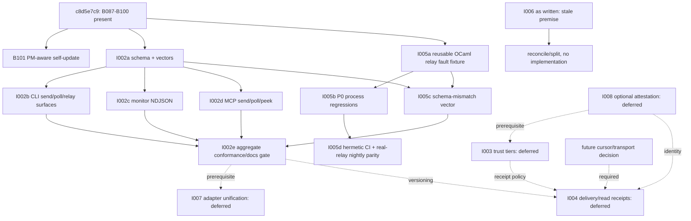

# T3 audit: pending friction futures at `c8d5e7c9`

Date: 2026-07-10

Audit base: `c8d5e7c93070058907fa5f342c23c45f63772b2e`

Scope: backlog B101 and I002-I008, with read-only reconciliation to the T0
inventory preserved in `7c669915`.

No code or backlog status was changed. This artifact records current behavior,
authority, acceptance criteria, dependencies, and implementation-ready slices.

## Executive result

| Backlog item | Current disposition | Why |
|---|---|---|
| B101 package-manager-aware self-update | **ACTIONABLE NOW** | Modern `self-update` still replaces the running native binary in place. It has no npm/pnpm/bun provenance or delegation. B092 only protects the installer fallback. |
| I002 canonical message JSON v1 | **ACTIONABLE NOW** | Honest send state and relay-aware monitor JSON exist, but send, monitor, CLI poll, and MCP poll/send still emit different shapes and none carries the requested message `schema_version`. |
| I003 trust tiers / TOFU authority gating | **PRESERVE DEFER** | Transport-key pinning, approval isolation, and untrusted-data framing are useful substrate, not the requested machine-anchor trust-tier engine. The trusted-swarm-first authority has not changed. |
| I004 delivery/read receipts and send waits | **PRESERVE DEFER** | B096 delivered non-destructive peek only. There are no durable subscriber cursors, delivery acks, consume acks, read receipts, or `send --wait`. Polling remains canonical. |
| I005 fake-relay regression oracle | **ACTIONABLE NOW, REFRAME TO REUSE** | The canonical OCaml relay already has an in-process state backend and a real loopback HTTP test server. The missing value is a reusable adverse-response/fault fixture, exact P0 process regressions, schema vectors, and CI/nightly parity—not another relay implementation. |
| I006 unknown relay-peer discovery | **PREMISE CONTRADICTED; RECONCILE, DO NOT IMPLEMENT AS WRITTEN** | B097 now ships opt-in authenticated `c2c list --relay`, returning all live relay peers with address/key/liveness and supporting `--match`. Remaining bare-alias ambiguity and address-card/introduction UX are different requirements. |
| I007 harness adapter unification | **PRESERVE DEFER** | The shared safety fragment, MCP registry, envelopes, and wake schedule are partial convergence. `c2c env --json`, schema-generated cross-harness tools, one hook contract, and conformance remain absent. I002 is still a prerequisite. |
| I008 machine anchor plus optional agent attestation | **PRESERVE DEFER** | The machine relay key and its documentation are real. The optional machine-signed agent certificate, envelope fields, verification, lifecycle, and compatibility tests do not exist. The later Max decision remains controlling over the report's per-agent relay-key proposal. |

There is no technical blocker to dispatching B101, the first I002 contract slice,
and the first I005 test-fixture slice in parallel. I006 needs backlog/product
reconciliation before any implementation dispatch. All other holds are deliberate
authority/dependency holds, not accidental omissions.

## Evidence method and base selection

Per `AGENTS.md`, code discovery started with `codebase-memory-mcp` graph searches
and call traces. The graph found the self-update path, send/monitor/poll encoders,
relay peek path, relay identity store, and in-process relay. All conclusions were
then checked against files in this exact worktree because the shared graph indexes
the main checkout, while this audit is explicitly pinned to `c8d5e7c9`.

`c8d5e7c9` is the correct implementation base for this closure campaign because
it is the prerequisite-bearing local master that already contains B087-B100.
Branching the first slices from `origin/master` could lose those local-only fixes
and make the B089/B096/I002/I004 reconciliations false. Independent first slices
may branch from `c8d5e7c9`; any later slice that consumes a new module or schema
from an earlier local-only slice is a chain-slice and must branch from that
prerequisite tip (or from local master after the coordinator integrates it).

## Exact current-state audit

### B101 — self-update must preserve the install method

**What exists now**

- `ocaml/cli/c2c_self_update.ml` resolves `/proc/self/exe`, downloads a GitHub
  release asset, verifies SHA-256, extracts `c2c`, and renames it over the
  running binary. Its only provenance distinction is the system-path refusal.
- The npm package's JS wrapper resolves a platform package binary and starts it
  with the unmodified environment. A globally installed npm/pnpm/bun package
  therefore runs the native binary inside a package store; the native process
  neither knows which package manager owns it nor delegates an upgrade.
- B092 is correctly complementary: `docs/install.sh` probes for `self-update`
  and falls through to a fresh standalone install when the command is absent or
  fails. `test/test_install_sh_self_update_fallthrough.sh` covers that installer
  decision, not B101's package-manager-preserving update.
- No npm/pnpm/bun self-update test exists.

**Acceptance criteria**

1. Standalone installs keep the current verified in-place binary flow.
2. A package-managed invocation detects recorded/wrapper-provided provenance and
   delegates to the owning manager: npm, pnpm, or bun. It must not overwrite a
   binary inside `node_modules` or a package-manager content-addressed store.
3. Default update selects `@clanker-code/c2c@latest`; a pinned version selects
   the matching package version. `--check` stays non-mutating.
4. Unknown/ambiguous package provenance fails with an actionable command and a
   non-zero exit rather than silently installing a standalone copy.
5. Human and JSON results identify the chosen install method/command without
   leaking unrelated environment data.
6. Hermetic tests cover standalone, npm, pnpm, bun, PATH-shadowed wrapper, failed
   manager command, and no mutation on `--check`.
7. Install/get-started/command docs explain that updates preserve ownership.

**Inventory mapping:** A003; stable-B115-B117 (especially the missing install
matrix at B116).

### I002 — lean canonical versioned message JSON v1

**What exists now**

- CLI `send --json` has honest `delivery.state` (`queued` or `delivered`) and a
  legacy top-level `queued`; direct relay responses can represent relay
  acceptance separately.
- `c2c monitor --json` emits flushed NDJSON with `event_type`, `monitor_ts`,
  `source`, and message fields. B089 already merges local and relay sources.
- CLI `poll-inbox --json` emits a bare array of `{from_alias,to_alias,content,ts}`.
- MCP `send` returns `{queued,ts,from_alias,to_alias,...}` without
  `delivery.state`; MCP poll/peek return arrays that omit `ts` and differ from
  CLI poll. The schema remains hand-described in tool text.
- `docs/monitor-json-schema.md` documents monitor events only. There is no one
  published send/monitor/poll schema and no message-level `schema_version` in
  these surfaces. Unrelated glyph/database/envelope version fields are not I002.

**B089 versus I002:** backlog B089 is genuinely closed for unified relay-aware
monitoring. It does not close I002: the merged stream is still only one of several
incompatible JSON surfaces. Preserve B089 tests and change only representation
through a backwards-compatible schema migration.

**Acceptance criteria**

1. Publish one v1 JSON Schema with a shared message core and explicit variants
   for a send result, a monitor event, and a poll batch. Every variant carries
   `schema_version: 1`; monitor remains one JSON object per NDJSON line and poll
   remains an array/batch surface.
2. V1 contains only current truthful fields plus `delivery.state` with
   `queued|accepted|delivered`. Identity/trust/verified/priority and `read` are
   explicitly reserved for later versions.
3. CLI send, relay direct-send result, monitor message events, CLI poll/peek,
   MCP send, and MCP poll/peek all validate against the published schema.
4. Legacy fields required by existing scripts remain during v1; a compatibility
   vector proves old readers can ignore the additive version/normalized fields.
5. `message_id`, timestamps, source, sender, recipient, content, and delivery
   are present wherever the underlying path truthfully has them; absence is
   represented by schema optionality, never fabricated data.
6. Positive and negative golden vectors cover local delivered, remote queued,
   relay accepted, local monitor message, relay monitor message, empty poll,
   and non-empty poll. CI rejects missing/wrong versions and invalid states.
7. The schema/reference page is linked from send, monitor, poll, MCP, and
   harness-integration docs. Generated/tool descriptions must not drift.

**Inventory mapping:** A033-A034, A041, A047, A050, A066; stable-B001,
B009-B013, B022, B028, B035-B037, B041, B052-B053, B064, B066, B069, B075,
B078-B079, B093, B102, B109, B120, B147, B156, B158-B159, B164, B167, B204,
B213-B216, B220, B229, B231-B232, B238, B242, B246-B247; C001, C004, C011,
C021, C042, C053.

### I003 — trust tiers, TOFU, and authority gating

**What exists now**

- The broker persists per-alias X25519/Ed25519 transport pins and detects a
  mismatch as `key-changed`. This is useful cryptographic substrate, but these
  are not yet the I008 machine-anchor/agent-attestation trust model.
- B098 restricts approval verdicts to locally configured supervisors. B099 and
  the shared skill frame peer messages as untrusted data.
- `--fail|--blocking|--urgent` currently adds presentation tags. It is not
  accepted/rejected/downgraded based on peer trust.
- `C2c_blocklist` bans unsafe/reserved alias names; it is not a peer trust
  blocklist. No `blocked|unknown|allowlisted|trusted` store or enforcement path
  exists.

**Future ACs retained without dispatch:** trust records keyed to the machine
anchor (plus optional certified agent key); loud key-change downgrade; persisted
allow/block management; unknown capped at FYI/no interrupt/no blocking; trusted
urgent allowed; blocked quarantine; rooms/broadcast abuse checks; no path around
B098 approval isolation. Activation requires an operator decision to leave the
trusted-swarm-first phase and I008 semantics first.

**Inventory mapping:** A053, A056, A059-A060, A064, A066, A069-A070, A072,
A074-A075; stable-B010, B018, B042, B058-B061, B067, B156, B205, B216, B227;
C005-C006, C029, C041, C054.

### I004 — durable delivery/read receipts and send waits

**What exists now**

- B088 truthfully distinguishes a locally queued remote send from a synchronous
  local delivery. This is reporting, not remote delivery tracking.
- B096 added `relay dm peek` and `/peek_inbox`; B089 uses it non-destructively
  and deduplicates repeated/cross-source observations by message ID.
- `wait-inbox` / `poll-inbox --wait` is a bounded receive wait. It is not
  `send --wait` and proves no sender-observable delivery transition.
- The relay has no durable independent subscriber cursor, delivery ack, signed
  consume ack, read event, sender wait state machine, or read privacy controls.
  Registration receipts are not message-read receipts.

**B096 versus I004:** the B096 backlog body bundled peek with cursor/ack language,
but its shipped code/tests/docs close only non-destructive peek. Status `done`
must not erase the remainder. I004 remains the explicit deferred owner for
cursors, at-least-once semantics, delivery/read transitions, and sender waits.

**Future ACs retained without dispatch:** durable per-subscriber cursors;
restart-safe at-least-once delivery and idempotent dedup; truthful
queued→accepted→delivered; bounded `send --wait=accepted|delivered`; signed
consume-ack; bilateral opt-in read receipts; default off; decline
indistinguishable from pending/offline; unknown/blocked peers receive no read;
bounded `send --wait=read`; complete privacy/protocol docs. Activation requires
a selected transport/cursor design, I002 versioning, and I008/I003 policy.

**Inventory mapping:** A031, A036-A037, A041-A044, A048, A051-A052;
stable-B062-B063, B069, stable-row B096, B205, B228; C017, C019-C035, C037,
C039.

### I005 — hermetic relay fault and regression oracle

**What exists now**

- The canonical OCaml relay already exposes `Relay.InMemoryRelay`; its unit
  suite covers registration, liveness, list, send, poll, peek, dead letters,
  rooms, identity binding, and related state behavior.
- `test_pow_relay.ml` instantiates the production `Relay_server` over
  `InMemoryRelay` on a loopback socket. It exercises real HTTP register/PoW,
  429 requirements, malformed PoW fields, rate escalation, and client retry.
- Focused B087/B088/B090/B098 tests exist, but only B098 has the requested exact
  named regression. B087 is parser-shape coverage rather than an end-to-end
  connector process/exit test; B088/B090 have equivalent differently named
  CLI tests.
- Docker CI runs a real multi-container relay roundtrip. There is no scheduled
  real-relay nightly workflow and no reusable fault injector for arbitrary 401,
  429, 5xx, delay/timeout, truncated JSON, or schema mismatch responses.
- The retained Python `c2c_relay_contract.py` explicitly says it is deprecated.
  Extending it would invert repository authority.

**Acceptance criteria**

1. Reuse the production OCaml `Relay.InMemoryRelay` and HTTP callback. Extract
   or wrap the current loopback server as reusable OCaml test support; do not
   create a competing relay implementation.
2. Provide deterministic per-route/per-call faults for null/malformed PoW,
   401, 429, 5xx, delay/timeout, truncated JSON, and (after I002) schema mismatch.
3. Drive the real CLI/connector process and assert bounded exit status, stderr,
   retry/backoff behavior, no false success, and no swallowed parser exception.
4. Preserve/add named P0 regressions for B087, B088, B090, and both B098 approval
   suites. Equivalent existing unit tests remain useful but do not replace the
   process boundary where the original bug lived.
5. Run register/PoW → list/status → DM send → peek/poll and rooms vectors in
   hermetic CI. Use the same semantic vectors for a separately scheduled real
   relay job; retain results and keep expected transient policy explicit.
6. Feed adverse fixtures into relay doctor/capabilities and assert stable FAIL,
   non-zero exit, and actionable `fix_command`.

**Inventory mapping:** A083, A088; stable-B027, B037, B044, B074-B075,
B082-B101, B110, B113, B119-B120, B122, B173, B185, B187, B189, B192-B193,
B211-B212, B233, B236, B249-B250; C024, C056.

### I006 — relay-peer discovery

The deferral's factual premise has changed. B097's `c2c list --relay` performs an
authenticated `/list`, merges relay peers, returns full addresses,
`identity_pk`, and liveness, and composes with `--match`. A registered agent can
therefore discover relay peers it did not already know.

Do not dispatch I006 as written and do not silently use it as the owner for
different requirements. Reconciliation should record the original unknown-peer
discovery gap as superseded/closed by B097 while splitting these still-open
questions:

- bare alias should resolve remotely only when unique, with explicit ambiguity
  candidates (A057-A058);
- address-card/token exchange remains unowned (A059);
- directory visibility, introductions, privacy, and abuse policy remain an
  operator/product decision, related to C040/C041.

The current audit leaves the backlog status untouched as required. Any future
scope remains deferred until the product/abuse model is selected.

**Inventory mapping:** A057-A059; stable-B065; C041 (directory remains optional).

### I007 — one core contract, N thin harness shims

**What exists now:** `C2c_mcp.base_tool_definitions` is a useful single registry
for MCP and runtime agent-help; the shared c2c skill supplies safety framing;
hooks share c2c envelope conventions; managed clients share `wake.toml`. These
are partial convergence only. Pi and other client adapters still expose distinct
names/schemas, there is no `c2c env --json`, no generated cross-harness tool
surface, no one push/hook contract, and no `c2c conformance` command.

**Future ACs retained without dispatch:** resolved-config/identity JSON with
documented precedence; generated logical tool schemas for all five clients;
one versioned safety fragment; one push/schedule semantic contract adapted to
each harness; conformance vectors and self-check; per-client docs/live smoke.
I002 must land first. I008 implementation remains the stated identity prerequisite
and may be re-evaluated only by the operator, not inferred away here.

**Inventory mapping:** A065; stable-B001, B004-B008, B012-B013, B029,
B037-B039, B064, B102, B105-B106, B109, B120, B133, B149, B158, B164, B207,
B229; C009-C016.

### I008 — machine trust anchor plus optional agent attestation

**What exists now:** the relay identity is one machine key at
`~/.config/c2c/identity.json`; registration/signing and public docs say so.
Local per-alias transport keys and `from_ed25519` encrypted-envelope fields exist,
but there is no machine-signed certificate binding an optional agent key to the
relay-registered machine key. Those fields must not be misreported as I008.

**Future ACs retained without dispatch:** ADR for the machine anchor; optional
per-session agent key; short machine-signed certificate in the message envelope;
verification from message one; invalid/forged/expired cert rejection; rotation
and lifecycle; one relay connection per machine; unsigned-message compatibility;
schema v2+ and identity/security docs. The report's mandatory per-agent relay
key is superseded and must not return through I002 or I003.

**Inventory mapping:** A053, A056, A059-A066, A074-A075, A080; stable-B001,
B010, B018, B042, B057-B059, B064, B067, B205, B216, B227; C003-C005, C017,
C025, C031, C033, C036, C041, C051, C057.

## Dependency graph

## Bounded implementation slices and file ownership

These slices avoid file collisions where practical and keep every commit
reviewable. File names marked “new” are proposed ownership boundaries, not files
created by this audit.

| Slice | Scope and owned files | Focused verification/docs | Base |
|---|---|---|---|
| F101 | Package provenance + dispatch: `npm-pkgs/c2c/bin/c2c-js-wrapper.js`, `npm-pkgs/c2c/index.js`, `ocaml/cli/c2c_self_update.ml`, new `ocaml/cli/test_c2c_self_update.ml`, `ocaml/cli/dune` | Fake npm/pnpm/bun executables; standalone/no-mutation/failure JSON tests; `docs/get-started.md`, `README.md`, `docs/commands.md` | `c8d5e7c9`; independent |
| J1 | V1 contract only: new `ocaml/c2c_message_schema.{ml,mli}`, new `schemas/message-v1.schema.json`, `ocaml/dune`, new `ocaml/test/test_c2c_message_schema.ml`, `ocaml/test/dune`, new `docs/reference/message-json-v1.md` | Positive/negative goldens, compatibility and version rejection; no surface migration yet | `c8d5e7c9`; independent |
| J2 | CLI send/poll/direct-relay adapters: `ocaml/cli/c2c_send_cmd.ml`, `ocaml/cli/c2c_inbox_cmd.ml`, `ocaml/cli/c2c_relay_cmd.ml`, relevant sections of `ocaml/test/test_c2c_cli.ml` | queued/delivered/accepted, empty/non-empty poll, legacy fields | chain from J1 |
| J3 | Monitor representation only: `ocaml/cli/c2c_monitor_cmd.ml`, new focused monitor-schema test or isolated additions to `ocaml/test/test_c2c_cli.ml`, `docs/monitor-json-schema.md` | local+relay NDJSON, flush, source, schema validation, B089 dedup unchanged | chain from J1; parallel with J2 |
| J4 | MCP representation only: `ocaml/c2c_send_handlers.ml`, `ocaml/c2c_inbox_handlers.ml`, `ocaml/c2c_mcp.ml`, focused `ocaml/test/test_c2c_mcp.ml` cases, `docs/commands.md` MCP sections | send/poll/peek schema equality and legacy compatibility | chain from J1; parallel with J2/J3 |
| F5a | Reusable canonical relay fixture: new `ocaml/test/relay_test_server.{ml,mli}` (or a small test-support library), `ocaml/test/dune`, migrate only server boilerplate from `ocaml/test/test_pow_relay.ml` | Existing PoW suite remains green; deterministic lifecycle/port cleanup | `c8d5e7c9`; independent |
| F5b | Fault/process matrix: new `ocaml/test/test_friction_relay_failures.ml`, `ocaml/test/dune`; production files change only for a proven bug | Exact B087/B088/B090/B098 process regressions; 401/429/5xx/timeout/truncated response; doctor fix checks | chain from F5a |
| F5c | Schema fault/vector: extend the new failure test only, plus shared schema goldens | Version mismatch and fake-vs-real semantic vector equality | chain from both J1 and F5a |
| F5d | CI/live evidence: `.github/workflows/ci.yml`, new narrowly scoped scheduled relay workflow, and `scripts/relay-smoke-test.sh` only if its existing interface can be reused | Hermetic every PR; scheduled real relay with bounded timeout and retained diagnostics | chain from F5b/F5c; live secrets/owner required |
| J5 | I002 closure gate: schema reference cross-links and aggregate conformance test; avoid implementation changes | `test_all_json_surfaces_conform_to_schema_v1`; docs drift; explicit reservation of v2 fields | chain after J2/J3/J4/F5c |

Parallel start: F101, J1, and F5a. Do not start J2/J3/J4 before J1, or F5c
before both J1 and F5a. Do not mark I002 or I005 complete until their aggregate
gates run in their slice worktrees and live/nightly ownership is recorded.

## Unowned open inventory items

These are not silently absorbed into the three actionable backlog items.

| Inventory rows | Current classification | Required reconciliation |
|---|---|---|
| A039; stable-B025 | Optional healthy-idle monitor heartbeat | Separate product decision after J1 defines event versioning. Not part of lean I002 without operator approval. |
| A059; stable-B065 | Address card / peer token import | Dependency-bound defer behind I008/I003 semantics. Do not keep under stale I006. |
| A073 | Correlate signed inbound messages with privileged-action audit | Security/observability design; depends on C043 responsibility boundary and local harness action IDs. Needs an owner before implementation. |
| A083 | Real-relay self-marker/roundtrip doctor probe | Candidate follow-up after F5a/F5d, but requires a privacy/cost-safe marker design and explicit doctor ownership. |
| A086-A087; stable-B065 | Redacted debug bundle + privacy contract | One separate tracer-bullet slice after product approval; redaction/secret-scan AC is load-bearing and must precede sharing UX. |
| C040 | Public/private/federated relay deployment model | Operator/product ADR, no implementation dispatch. |
| C043 | c2c-vs-harness prompt-injection responsibility | Security responsibility matrix/red-team decision, no inference from B098/B099 alone. |
| C044 | Alias-release trust reset | Future I008/I003 security AC; operator-approved ADR/test owner required. |
| C045 | Local-broker-vs-relay inbox authority/reconciliation | Future cursor/delivery ADR; blocks I004 transport semantics. |

Part B's many open AC/test/doc rows are retained under J1-J5, F5a-F5d, or an
explicit product/deferred classification above. Repeated milestone wording is
not multiplied into duplicate tasks; stable row IDs remain attached to the
aggregate tests.

## Blockers and handoff

- **No blocker:** F101, J1, and F5a can begin now from `c8d5e7c9`.
- **External blocker for F5d only:** a named owner and secret/flakiness policy
  for scheduled production-relay tests. Hermetic I005 work does not wait on it.
- **Reconciliation blocker:** I006's premise is stale after B097. The
  coordinator/operator should close/supersede or split it before any I006-labeled
  implementation starts; this audit intentionally did not mutate its status.
- **Authority blockers:** I003/I004/I007/I008 remain explicitly deferred. Their
  missing code is not permission to start them.
- **Decision blockers:** C040/C043/C044/C045 and the unowned product proposals
  need recorded owners/dispositions before implementation.

Recommended handoff order: dispatch F101 + J1 + F5a in parallel; integrate J1;
run J2/J3/J4 and F5b in parallel; add F5c; close with J5; schedule F5d only after
the live-test owner is explicit. Preserve B089 and B096 regression proofs
throughout.
